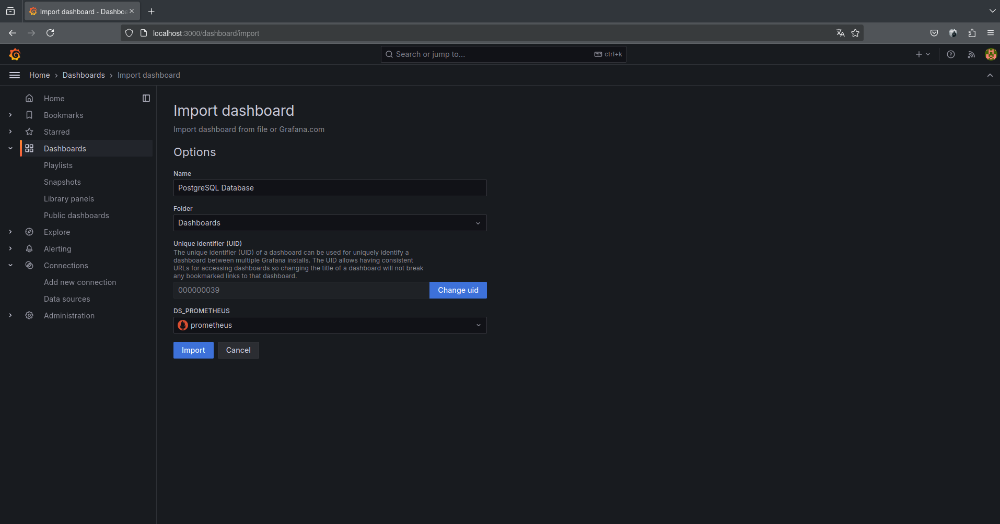

# Wolfgres Finalcial App (Demo)

Esta aplicación nos permitirá realizar una prueba de estrés a una base de datos postgresql, que nos permitirá especificar el numero de transacciones por tabla.

## Configuración

1. El primer requerimiento es tener golang y docker instalado en su version actual.
2. Se deberá crear el archivo de configuración `config.yaml` en el directorio `financial_app/config/`.
3. Copiar el contenido del archivo `config_example.yaml` al nuevo archivo `config.yaml` y modificar los parametros de conexión de los nodos de la base de datos.

```
database:
  node_1:
    host: localhost
    port: 5432
    admin_user: postgres
    admin_pass: postgres
    database_name: wolfgres_db
```

## Ejecución

Para ejecutar la aplicación debemos seguir los siguientes pasos:

1. Tener previamente configurado el archivo de configuración `config.yaml` especificado anteriormente.
2. (Opcional) Compilar la aplicación con el comando siguiente:

```
go build -o ./bin/wfg_financial_app
```

3. Ejecutar la aplicación con los siguientes comando:

3.1 Con archivo compilado:

```
./bin/wfg_financial_app [flags]
```

3.2 Con el archivo `main.go`

```
go run main.go [flags]
```

3.1 Flags

```
  -d, --duration int       Test duration in seconds
  -g, --goroutines int     Number of concurrent goroutines
  -h, --help               help for financial_app
  -c, --max-conns int      Maximum number of connections in the pool
  -m, --miliseconds int    Milliseconds that a transaction takes to execute
  -o, --operation int      Choose a stress test transactions: INSERT=1, SELECT=2, UPDATE=3
  -t, --transactions int   Number of transactions. Must be a number that are multiples of goroutine
```

4. Ejemplos de ejecución.

4.1 Ejecutar por número de transacciones por tabla:

```
go run main.go -m 50 -g 20 -t 100 -o 1
```

4.2 Ejecutar por duración en segundos:

```
go run main.go -m 50 -g 20 -d 60 -o 1
```

## Visualización

Para visualizar de forma grafica lo que sucede en la prueba de estrés realizaremos los siguientes pasos:

1. Como primer paso debemos de ajsutar el archivo `docker-compose-grafana.yml` a nuestras necesidades. El ejemplo de la
consiguración actual del archivo es para una arquitectura HA con un nodo primario y uno secundario, con sus 
respectivas credenciales de acceso.

```
  postgres-exporter-primary:
    image: prometheuscommunity/postgres-exporter
    ports:
      - 9187:9187
    environment:
      DATA_SOURCE_URI: "192.168.1.94:4431/wolfgres_db?sslmode=disable"
      DATA_SOURCE_USER: wolfgres_user
      DATA_SOURCE_PASS: VB7tZ99dulum
    links:
      - prometheus

  postgres-exporter-secondary:
    image: prometheuscommunity/postgres-exporter
    ports:
      - 9188:9187
    environment:
      DATA_SOURCE_URI: "192.168.1.94:4432/wolfgres_db?sslmode=disable"
      DATA_SOURCE_USER: wolfgres_user
      DATA_SOURCE_PASS: VB7tZ99dulum
    links:
      - prometheus
```

2. Una vez realizado la consiguracion de los parametros anteriores, se deberá editar el archivo `prometheus.yml` en
los parametros globales y los scrape_configs como en el siguiente ejemplo:

> [!IMPORTANT]
> El puerto deberá ser 9187 el mismo en todos los casos para postgres-exporter-[node] ya que estarán dentro de la misma red.

```
global:
  scrape_interval: 5s
  evaluation_interval: 5s

scrape_configs:
  - job_name: prometheus
    static_configs:
      - targets: ["prometheus:9090"]

  - job_name: postgres-exporter-primary
    static_configs:
      - targets: ["postgres-exporter-primary:9187"]

  - job_name: postgres-exporter-secondary
    static_configs:
      - targets: ["postgres-exporter-secondary:9187"]
```

3. Posteriormente a los pasos anteriores se podrá ejecutar el archivo con el siguiente comando:

```
docker compose -p monitoring -f docker-compose-grafana.yml up -d
```

> [!TIP]
> Para detener la ejecución anterior debemos ejecutar `docker compose -p monitoring down`

4. Una vez ejecutado, accederemos desde el navegador la dirección a [Grafana](http://localhost:3030/). Las credenciales que utilizaremos son:

- User:     `admin`
- Password: `admin`


6. Despues nos pedirá que ingresemos una nueva contraseña para continuar.


7. Antes de seguir debemos obtener la IP generada por docker para Prometheus, la cual podremos saberla en 
la sección de `monitoring-prometheus-1` con el siguiente comando:

```
docker network inspect monitoring_default
```

8. Continuando con la configuración de Grafana, nos dirijimos al menú Connection/Data sources/ y seleccionamos
a Prometheus:


9. En la configuración de Prometheus solo añadimos URL tomando como base la IP del paso 7 y el puerto 9090 default,
en los ajustes de TLS solo marcamos `Skip TLS certificate validation` y guardamos la configuración con el boton inferior 'Save & Test'.


10. Cuando se guarde correctamente la configuración, damos clic a la opción de **Dashboards > New > Import**. En esta sección cargamos el archivo `9828_rev8.json` del directorio `financial_app/resources/dashboard/` y completamos el campo Name, DS_PROMETHEUS (Seleccionamos el data soruce que creamos en los pasos anteriores) e importamos.



11. Por último, podremos visualizar los datos relevantes de las instancias de PostreSQL.


